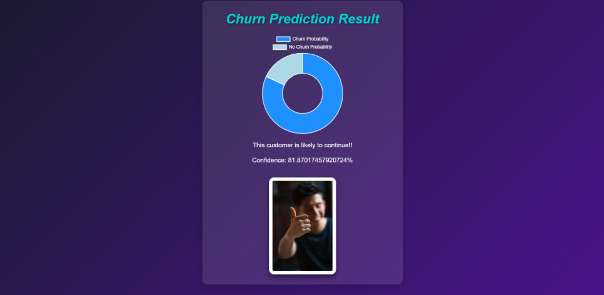

#  Customer Churn Prediction

A Machine Learning web application built with Flask that predicts whether a telecom customer is likely to churn or continue their service. It uses a trained Random Forest model to analyze customer data (like tenure, monthly charges, contract type, and service usage) to calculate the churn probability.

## 🌟 Features

*   **User-Friendly Web Interface:** Easy-to-use form to input customer data.
*   **Real-time Prediction:** Get instant predictions on customer churn likelihood.
*   **Confidence Score:** Displays the probability/confidence percentage of the prediction visually using a dynamic pie chart.
*   **Data Processing:** Automatically handles data encoding and scaling internally based on the original training dataset.

## 📸 Screenshot



## 🛠️ Tech Stack

*   **Backend:** Python 3.x, Flask
*   **Machine Learning:** Scikit-Learn (RandomForestClassifier), Pandas, NumPy
*   **Frontend:** HTML, CSS

## 📁 Project Structure

```text
📦 Customer-churn-prediction
 ┣ 📂 static             # CSS and static images like happy/sad customer photos
 ┣ 📂 templates          # HTML templates (home.html, result.html)
 ┣ 📜 app.py             # Main Flask application
 ┣ 📜 train_model.py     # Script used to train and save the ML model
 ┣ 📜 model.sav          # Saved Random Forest model
 ┣ 📜 model_columns.pkl  # Saved dataframe columns for encoding matching
 ┣ 📜 WA_Fn-UseC_-Telco-Customer-Churn.csv # Original dataset
 ┗ 📜 README.md          # You are here!
```

## 🚀 How to Run Locally

1. **Clone the repository** (if you haven't already):
   ```bash
   git clone https://github.com/Komalpreet2809/Customer-churn-prediction.git
   cd Customer-churn-prediction
   ```

2. **Create a Virtual Environment** (Recommended):
   ```bash
   python -m venv venv
   # On Windows:
   .\venv\Scripts\activate
   # On Mac/Linux:
   source venv/bin/activate
   ```

3. **Install Dependencies**:
   Since there is no `requirements.txt`, install them manually:
   ```bash
   pip install flask pandas scikit-learn
   ```

4. **Run the Application**:
   ```bash
   python app.py
   ```

5. **Open in your Browser**:
   Navigate to [http://127.0.0.1:5000/](http://127.0.0.1:5000/)

## 🧠 Model Training (Optional)
If you wish to retrain the model on new data:
1. Replace or update the `WA_Fn-UseC_-Telco-Customer-Churn.csv`.
2. Run `python train_model.py`.
3. This will overwrite `model.sav` and `model_columns.pkl` with the newly trained model weights.

## ☁️ Deploy on Vercel

This project uses Flask and can be deployed directly to Vercel. Vercel detects `app.py` automatically.

1. Push the project to GitHub.
2. Import the repository in Vercel.
3. Keep the project root at the folder containing `app.py`.
4. Deploy.

No `api/` folder or custom `vercel.json` is required for the current Vercel Flask runtime.
